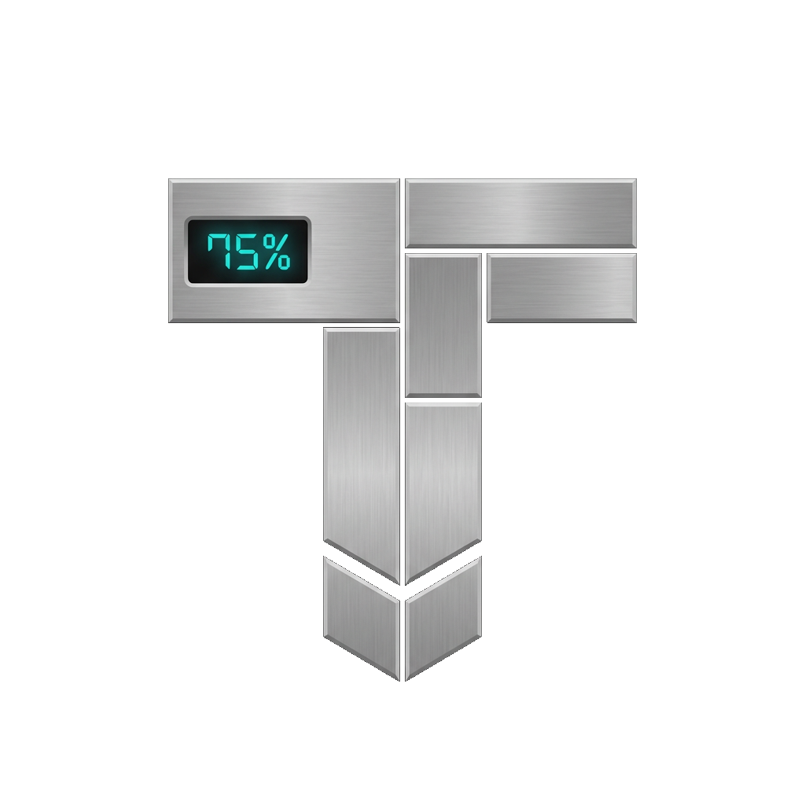

<p align="center">
  
</p>

# TARS

[](LICENSE)

> 灵感来自《星际穿越》中的机器人 TARS —— 忠诚、可靠、默默干活的通用 AI Agent。

TARS 是一个**通用型 AI Agent 桌面应用**：你给它一个任务，它通过 ReAct（Reasoning + Acting）循环自主规划、调用工具、执行并回填结果，直到任务完成。基于 Go + Wails v3 构建，模型侧通过 [Eino](https://github.com/cloudwego/eino) 接入 Google Gemini。

## 功能特性

- **ReAct Agent Loop**：流式请求 LLM → 检测 tool_calls → 并行执行工具 → 结果回填 → 继续推理，直到给出最终回复（最大 25 轮）
- **内置工具集**：`read_file`、`search_replace`、`list_dir`、`search_text`、`run_command`，均带工作区边界限制与输出截断保护
- **流式 UI**：实时展示模型深度思考过程（reasoning）、工具调用卡片（运行中/完成状态）、消息状态栏（tokens/耗时/复制/删除）
- **会话隔离**：每个会话拥有独立目录，包含会话数据、追踪日志与专属 `workspace/` 工作目录，工具操作互不影响
- **会话持久化**：JSONL 追加式存储（与 Codex / Claude Code 相同方案），重启自动恢复历史会话
- **OpenTelemetry 可观测**：遵循 GenAI + OpenInference 语义约定，本地每会话一份 `trace.jsonl`，可同时导出到 Jaeger / Phoenix 等 OTLP 后端

## 技术栈

| 层 | 技术 |
|---|---|
| 桌面框架 | Wails v3（Go + Webview） |
| 后端 | Go 1.26+，Agent 循环 / 工具系统 / 会话存储 |
| 前端 | React + TypeScript + Vite（rolldown） |
| LLM | Eino（CloudWeGo），Gemini 原生 Provider（完整支持 thought_signature） |
| 追踪 | OpenTelemetry（OTLP/HTTP + OTLP/gRPC 双导出） |

## 快速开始

### 环境要求

- Go 1.26+
- Node.js 20+
- Wails v3 CLI：
  ```bash
  go install github.com/wailsapp/wails/v3/cmd/wails3@latest
  ```
- Linux 桌面依赖（Debian/Ubuntu 示例）：
  ```bash
  sudo apt install libgtk-3-dev libwebkit2gtk-4.1-dev
  ```

### 配置

```bash
cp config/config.example.yaml config/config.yaml
```

编辑 `config.yaml`，填入 Gemini API Key（[免费申请](https://aistudio.google.com/apikey)），或使用环境变量注入：

```yaml
llm:
  apiKey: ${GEMINI_API_KEY}
  modelId: "gemini-3.1-flash-lite"
```

`config.yaml` 已在 `.gitignore` 中，不会入库。

### 开发模式

```bash
wails3 dev
```

前端热更新 + 后端自动重启。

### 生产构建（Linux）

```bash
wails3 build
```

产物输出到 `bin/tars`。

## 可观测性

每次对话的完整执行过程（LLM 请求/响应、token 用量、工具调用与结果）都会记录为 OpenTelemetry span：

- **本地文件**：每个会话目录下的 `.logs/trace.jsonl`（span JSONL，含 parentSpanId 可还原调用树）
- **Jaeger**（通用瀑布图）：
  ```bash
  docker run -d -p 16686:16686 -p 4318:4318 jaegertracing/all-in-one
  ```
- **Phoenix**（LLM 专属视图：token 统计、消息气泡、工具卡片）：
  ```bash
  docker run -d -p 6006:6006 -p 4317:4317 arizephoenix/phoenix
  ```

在 `config.yaml` 中启用对应 endpoint 即可同时导出：

```yaml
trace:
  otlpHttpEndpoint: "localhost:4318"   # Jaeger
  otlpGrpcEndpoint: "localhost:4317"   # Phoenix
```

## 数据目录

默认位于 `~/tars/`（可用 `config.yaml` 的 `workDir` 覆盖）：

```
~/tars/conversations/{uuid}/
├── .data/
│   ├── session.jsonl     # 消息记录（追加式）
│   └── meta.json         # 标题与时间戳
├── .logs/
│   └── trace.jsonl       # 该会话的追踪 span
└── workspace/            # 该会话的工作目录（工具文件操作的根）
```

## License

[Apache License 2.0](LICENSE)
