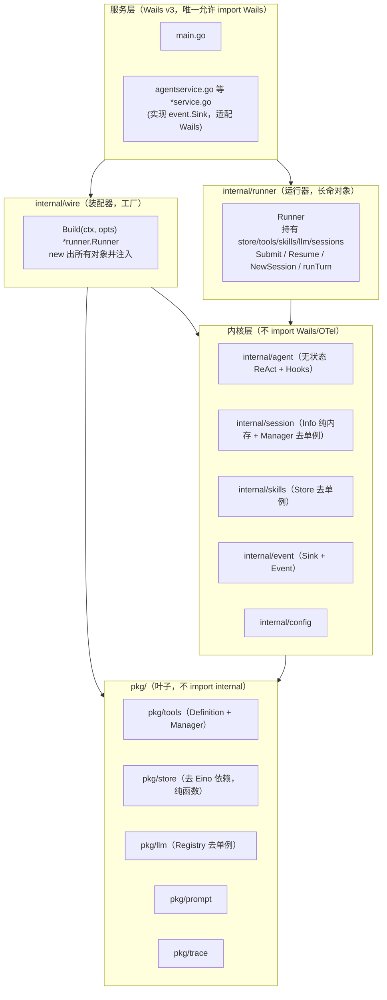

# TARS 架构重构计划

> 目标：参照 Reasonix 的类层次结构设计，重构 TARS 的会话 / 存储 / Agent Loop / 工具 / Skills 模块，消除全局单例耦合与框架耦合。
>
> 核心命名约定：**运行器 = `runner`，装配器 = `wire`**。

---

## 1. 背景与现状问题

当前 TARS 的架构存在以下主要问题：

| 问题 | 具体表现 | 影响 |
|------|---------|------|
| 全局单例泛滥 | `tools.DefaultManager()`、`store.GetSessionStore()`、`llm.GetRegistry()`、`skills.GetManager()`、`session.GetManager()` 散落各处 | 隐式依赖、难测试、无法多实例 |
| `turn` 是 God Package | 同时承担装配、编排、Hooks 适配，直接 import Wails + OpenTelemetry | 内核绑死框架 |
| `session.Info` 充血模型 | 既存数据又直接持久化 | 会话与存储职责混淆 |
| `store` 反向依赖 Eino | `store.Message` 使用 `schema.RoleType` | 最底层包绑死第三方 |
| 事件是字符串魔法 | `application.Get().Event.Emit("agent:chunk", ...)` 散落 | 无编译期检查，前端手写镜像类型 |
| 无分层约束 | `pkg/` 与 `internal/` 边界靠自觉 | 依赖方向易破 |

---

## 2. 设计目标与原则（对齐 Reasonix）

1. **装配与运行分离**：`wire` 是唯一 new 对象的地方，`runner` 只负责驱动。
2. **依赖倒置**：去掉所有全局单例，改构造注入 + 接口注入。
3. **内核不依赖框架**：`internal/*` 不 import Wails / OpenTelemetry，通过 `event.Sink` 接口输出。
4. **会话 = 文件**：存储是纯函数，会话是纯内存态。
5. **分层单向依赖**：`pkg/` 不 import `internal/`；`internal/*` 不 import Wails；只有服务层碰 Wails。

---

## 3. 目标分层架构



**依赖方向铁律**：`pkg/` 不 import `internal/`；`internal/*` 不 import Wails；只有 `main.go` + `*service.go` 能碰 Wails。

---

## 4. 核心类型设计

### 4.1 Runner（运行器，长命对象）

由原 `internal/turn` 改造而来，等价于 Reasonix 的 `Controller`。从「短命对象（每次对话 new 一次）」改为「长命对象（wire.Build 时 new 一次，常驻）」。

```go
// internal/runner/runner.go
type Runner struct {
    store    *store.SessionStore
    tools    *tools.Manager
    skills   *skills.Manager
    llm      *llm.Registry
    sessions *session.Manager   // 会话注册表，普通字段（非全局单例）
    sink     event.Sink         // 事件出口
}

// 会话生命周期（原 session.Manager 能力并入）
func (r *Runner) NewSession() (*session.Info, error)
func (r *Runner) Resume(path string) error
func (r *Runner) Delete(id string) error

// 一轮对话（原 turn.Start 核心，不再自己装配）
func (r *Runner) Submit(sessionID, content string) error {
    sess := r.sessions.Find(sessionID)
    sess.AppendUserTurn(content)
    return r.runTurn(sess, content)   // 私有方法，跑 ReAct 循环
}
```

### 4.2 Wire（装配器，工厂）

```go
// internal/wire/wire.go
type Options struct {
    WorkDir string
    Config  *config.Config
    Sink    event.Sink
}

func Build(ctx context.Context, opts Options) (*runner.Runner, error) {
    store := store.NewSessionStore(opts.WorkDir)
    tools := tools.NewManager(opts.WorkDir)
    skills := skills.NewManager(opts.WorkDir, opts.Config.Skills)
    llm := llm.NewRegistry(opts.Config.LLM)
    sessions := session.NewManager(store)

    return runner.New(runner.Options{
        Store:    store,
        Tools:    tools,
        Skills:   skills,
        LLM:      llm,
        Sessions: sessions,
        Sink:     opts.Sink,
    }), nil
}
```

---

## 5. 模块改造对照表

| 现有模块 | 改造后 | 主要改动 |
|---------|--------|---------|
| `internal/turn` | `internal/runner` | 改名 + 长命化 + 装配逻辑上移 wire |
| `internal/session.Manager` | 保留，去单例 | 删 `instance` / `GetManager()` / `InitManager()`，改构造注入 |
| `internal/skills.Manager` | 保留，去单例 | 同上 |
| `pkg/tools.Manager` | 保留，去单例 | 删 `defaultManager` / `DefaultManager()` |
| `pkg/store.SessionStore` | 保留，去单例 | 删 `instance` / `GetSessionStore()` |
| `pkg/llm.Registry` | 保留，去单例 | 删 `defaultRegistry` / `GetRegistry()` |
| `internal/event` | 加 `Sink` + `Event` | 从纯载荷包升级为事件流定义 |
| `internal/session.Info` | 瘦身 | 剥离持久化，只留内存态 |
| `pkg/store.Message` | 去 Eino 依赖 | `Role` 改用自定义 string 常量 |
| （新增）`internal/wire` | 装配层 | new 所有对象并注入 |

---

## 6. 分阶段迁移计划

> 每阶段 `go build` + `go test` 通过后才进入下一阶段。大范围替换用 IDE 重命名，避免手改遗漏。

### 阶段 1：消灭全局单例（纯机械重构，不改行为）

**目标**：把所有全局单例的状态收拢到显式对象，改构造注入。

**改动**：

| 文件 | 改动 |
|------|------|
| `pkg/tools/manager.go` | 保留 `Manager`，删 `defaultManager` + `DefaultManager()` |
| `pkg/store/session.go` | 保留 `SessionStore`，删 `instance` + `GetSessionStore()` |
| `pkg/llm/registry.go` | 保留 `Registry`，删 `defaultRegistry` + `GetRegistry()` |
| `internal/skills/manager.go` | 保留 `Manager`，删 `instance` + `GetManager()` |
| `internal/session/manager.go` | 保留 `Manager`，删 `instance` + `GetManager()` + `InitManager()` |

**验收标准**：全项目 `grep -E "GetManager|DefaultManager|GetSessionStore|GetRegistry"` 结果为 0。

### 阶段 2：引入 `internal/wire` 装配层

**目标**：把散落在 `agentservice.go`（初始化）和 `turn.Start`（装配）的逻辑收拢到 `wire.Build`。

**改动**：
- 新增 `internal/wire/wire.go`。
- `agentservice.go` 的 `ServiceStartup` 改为调 `wire.Build` 拿 Runtime。

**验收标准**：`ServiceStartup` 只剩「加载配置 → wire.Build → 存 Runtime」，不再有 `InitXxx` 调用。

### 阶段 3：改造 `turn` → `runner`

**目标**：把 `turn` 变成长命运行器，并入 `session.Manager` 的会话管理能力。

**改动**：
- 目录 `internal/turn` 重命名为 `internal/runner`。
- `Runner` 持有 `store/tools/skills/llm/sessions` 依赖。
- 会话生命周期方法（NewSession/Resume/Delete）从 `session.Manager` 移到 `Runner`。
- `turn.Start` 的装配逻辑上移到 `wire`。

**验收标准**：`runner` 包不再调用任何 `GetXxx()`；`session.Manager` 不再被 `runner` 直接 import（由 wire 组装）。

### 阶段 4：事件抽象（引入 `event.Sink`）

**目标**：让内核脱离 Wails，通过 `event.Sink` 接口输出。

**改动**：
- `internal/event` 加 `Sink` 接口 + `Event`（带 `Kind` 标签）。
- `runner` 的 Hooks 实现改为 `sink.Emit(...)`，不再 `application.Get().Event.Emit(...)`。
- `agentservice.go` 实现 `wailsSink`，把 `event.Event` 适配成 Wails 事件。

**验收标准**：`internal/runner` 里 `grep "wailsapp"` 结果为 0。

### 阶段 5：`session.Info` 瘦身 + `store` 去 Eino 依赖

**目标**：分离会话数据与持久化，底层包脱离第三方。

**改动**：
- `session.Info` 剥离 `AppendMessage/SetTitle` 里的 `store` 调用，持久化由 `runner` 显式执行。
- `store.Message.Role` 改用自定义 `string` 常量，去掉 `schema.RoleType`。

**验收标准**：`pkg/store` 里 `grep "eino"` 结果为 0；`session.Info` 不再 import `pkg/store` 的持久化方法。

---

## 7. 迁移顺序与风险控制


**共同原则**：

1. 纯机械重构优先（阶段 1 不改行为，只改注入方式）。
2. 每阶段可独立提交、可回退，不出现「改到一半跑不起来」。
3. 阶段 1 可保留 deprecated 包装函数过渡，迁移完成后再删。
4. 命名收敛：`runner` = 运行器（长命），`wire` = 装配器（工厂）。

---

## 8. 推荐切入点

如果只先做一件事验证方向，从**阶段 1 的 `store.GetSessionStore()`** 开始：

1. `store.SessionStore` 去掉全局 `instance`，改 `NewSessionStore(workDir)` 返回实例。
2. 在 `wire.Build`（或临时在 `ServiceStartup`）里 new 一次。
3. 把 `store.GetSessionStore()` 的调用点改成通过参数传入。

这一个改动即可直观感受到「全局单例 → 构造注入」的变化，是后续所有阶段的基石。
